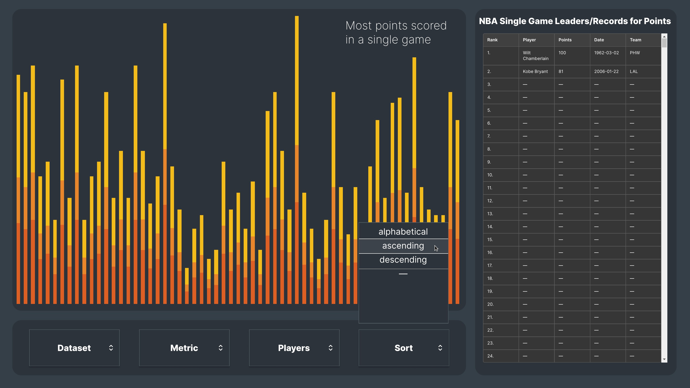
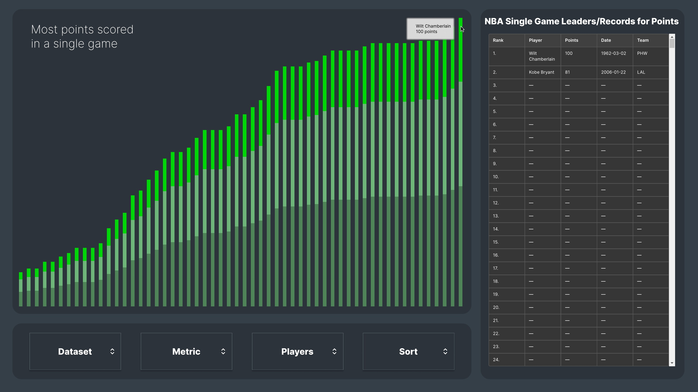
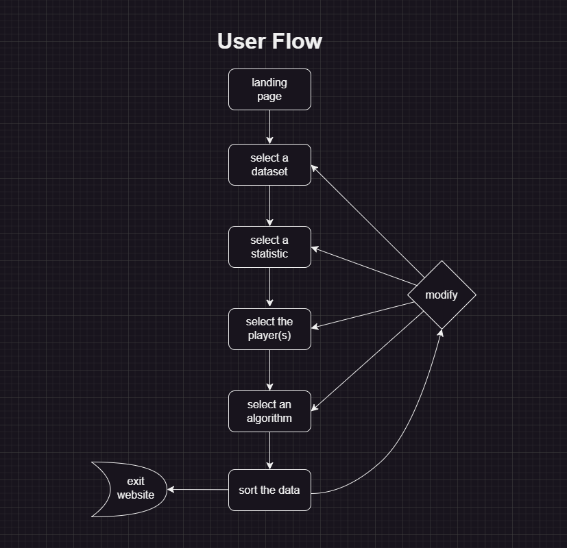

# NBA Analytics Visualizer

A dynamic visualization tool for exploring NBA player statistics and advanced metrics with real-time sorting algorithm animations.


## Table of Contents

1. [Project Overview](#project-overview)
2. [Motivation](#motivation)
3. [Features](#features)
4. [Project Status](#project-status)
5. [Getting Started](#getting-started)
   - [Prerequisites](#prerequisites)
   - [Installation](#installation)
   - [Running Locally](#running-locally)
6. [Usage](#usage)
   - [Current Functionality](#current-functionality)
   - [Planned User Flow](#planned-user-flow)
7. [Tech Stack](#tech-stack)
8. [Roadmap](#roadmap)
9. [Acknowledgements](#acknowledgements)
10. [Resources](#resources)

## Project Overview

The NBA Metrics Visualizer is an interactive web application designed to help basketball enthusiasts, analysts, and fans explore and visualize NBA player statistics. The tool provides real-time sorting of NBA player metrics with animated visualizations of various sorting algorithms in action.

Users can select different NBA statistics to visualize, choose from multiple sorting algorithms, and watch the sorting process happen in real-time. This creates not only a practical tool for NBA analytics but also an educational platform for understanding how different sorting algorithms work with real-world data.



## Motivation

The inspiration for this project came from wanting to create something that combined my interests in basketball analytics and algorithm visualization. While exploring project ideas, I was initially drawn to building a sorting algorithm visualizer similar to [Clement Mihailescu's project](https://youtu.be/pFXYym4Wbkc?si=0TJOIc0Y_7DUY1-z), but I wanted to add an original twist.

After consulting various online forums about the value of unique projects versus reimagining existing concepts, I decided to merge the concept of sorting visualization with practical NBA statistics analysis. This approach allows users to not only see sorting algorithms in action but also gain insights into NBA player performance metrics - creating a tool that is both educational and practical.

This project serves as a showcase of my skills in frontend development, data visualization, and algorithm implementation following my completion of freeCodeCamp's _Foundational C# with Microsoft_ Developer Certification.

## Features

- **Interactive Data Visualization**: Bar graph representation of NBA player statistics
- **Multiple Sorting Algorithms**: Implementation of Merge Sort, Quick Sort, Bubble Sort, Selection Sort, and Bucket Sort
- **Real-time Animation**: Watch sorting algorithms work in real-time
- **Customizable Metrics**: Select from various NBA player statistics
- **Educational Component**: Visual representation of algorithm efficiency and complexity
- **Responsive Design**: Optimized for desktop and mobile viewing
- **Database Integration**: Pull from updated NBA statistics database



## Project Status

**Current Development Stage:** Early Development

- ✅ Landing page and informational website complete
- ✅ UI/UX design and mockups finalized
- ✅ Data collection scripts implemented
- 🚧 Visualization tool in development
- 🚧 Sorting algorithm implementations in progress
- 🚧 Database integration in progress

The project currently has a functional informational website with the landing page, about section, and contact forms. The core visualization tool and sorting algorithm animations are still under active development.

## Getting Started

### Prerequisites

- [.NET Core SDK 6.0](https://dotnet.microsoft.com/download/dotnet/6.0) or higher
- [Node.js](https://nodejs.org/) (v14.x or higher)
- [Python](https://www.python.org/downloads/) (v3.8 or higher) - for data collection scripts
- Modern web browser (Chrome, Firefox, Edge, Safari)

### Installation

1. Clone the repository:

   ```bash
   git clone https://github.com/jSwAggy01/NBA-Metrics-Visualizer.git
   cd NBA-Metrics-Visualizer
   ```

2. Install Python dependencies (for data collection script):

   ```bash
   pip install pandas nba_api tqdm
   ```

3. Install frontend dependencies:
   ```bash
   npm install
   ```

### Running Locally

1. To view the informational website:

   ```bash
   # Open index.html in your browser
   ```

2. To run the data collection script (optional):
   ```bash
   python collectStats.py
   ```

## Usage

### Current Functionality

At present, the project has the following functional components:

1. **Informational Website**:

   - Landing page with project introduction
   - About section with project details
   - Contact form (front-end only)
   - Responsive design for all devices

2. **Data Collection Scripts**:
   - Python script to collect NBA player statistics
   - Data processing and CSV export

```python
# Sample of the NBA stats collection functionality
def collect_player_statistics():
    """
    Main function to collect statistics for all active players
    Returns a DataFrame with player stats
    """
    setup_logging()
    logging.info("Starting player statistics collection")

    # Get active players
    active_players = get_active_players()
    if not active_players:
        logging.error("No active players found")
        return pd.DataFrame()

    logging.info(f"Found {len(active_players)} active players")

    # Initialize lists to store player data
    all_stats = []

    # Process each player with progress bar
    for player in tqdm(active_players, desc="Collecting player stats"):
        player_id = player['id']
        player_stats = get_player_stats(player_id)

        if player_stats is not None:
            # Add player name to stats
            player_stats['PLAYER_NAME'] = player['full_name']
            all_stats.append(player_stats)

        # Add delay to avoid rate limiting
        time.sleep(0.6)

    # Combine all player stats into a single DataFrame
    if all_stats:
        final_df = pd.concat(all_stats, ignore_index=True)

        # Select relevant columns and rename them for clarity
        columns_of_interest = {
            'PLAYER_NAME': 'Player',
            'PTS': 'Points',
            'AST': 'Assists',
            'REB': 'Rebounds'
        }

        final_df = final_df[columns_of_interest.keys()].rename(columns=columns_of_interest)

        # Sort by points in descending order
        final_df = final_df.sort_values('Points', ascending=False)

        logging.info(f"Successfully collected stats for {len(final_df)} players")
        return final_df
    else:
        logging.error("No player statistics were collected")
        return pd.DataFrame()
```

### Planned User Flow

The visualization tool, once completed, will follow this user flow:

1. Landing page
2. Select a dataset (season, player pool)
3. Select a statistic to visualize
4. Select players to include
5. Choose a sorting algorithm
6. Watch the visualization
7. Modify parameters as needed



## Tech Stack

- **Frontend**: HTML, CSS, JavaScript
- **Backend**: ASP.NET Core MVC, C# (planned)
- **Data Collection**: Python with NBA API
- **Data Visualization**: Chart.js (planned)
- **Development Methodology**: Agile

## Roadmap

This project is being developed in phases:

1. **Planning & Design** (1-2 weeks) ✅

   - Define objectives and metrics
   - Create wireframes and mockups
   - Design data flow and architecture

2. **Development** (4-8 weeks) 🚧

   - ✅ Informational website
   - ✅ Data collection scripts
   - 🚧 Database connection and data model
   - 🚧 Visualization tool development
   - 🚧 Sorting algorithms and animation
   - 🚧 Integration and testing

3. **Testing & Deployment** (1-2 weeks) 📅
   - Unit testing and manual testing
   - Deployment to web hosting platform

## Acknowledgements

- [NBA API](https://github.com/swar/nba_api) for providing access to NBA statistics
- [Chart.js](https://www.chartjs.org/) for visualization components
- [freeCodeCamp](https://www.freecodecamp.org/) for educational resources
- [Clement Mihailescu](https://www.youtube.com/c/ClementMihailescu) for inspiration

## Resources

- [Sorting Algorithm Visualizations](https://www.toptal.com/developers/sorting-algorithms)
- [NBA Statistics](https://www.nba.com/stats)
- [ASP.NET Core Documentation](https://docs.microsoft.com/en-us/aspnet/core/)
- [Reddit Thread: Personal Projects](https://www.reddit.com/r/learnprogramming/comments/kbziax/how_do_you_find_ideas_for_personal_projects_i/)
- [Reddit Thread: Project Uniqueness](https://www.reddit.com/r/cscareerquestions/comments/74zcob/do_side_projects_have_to_be_unique/)
